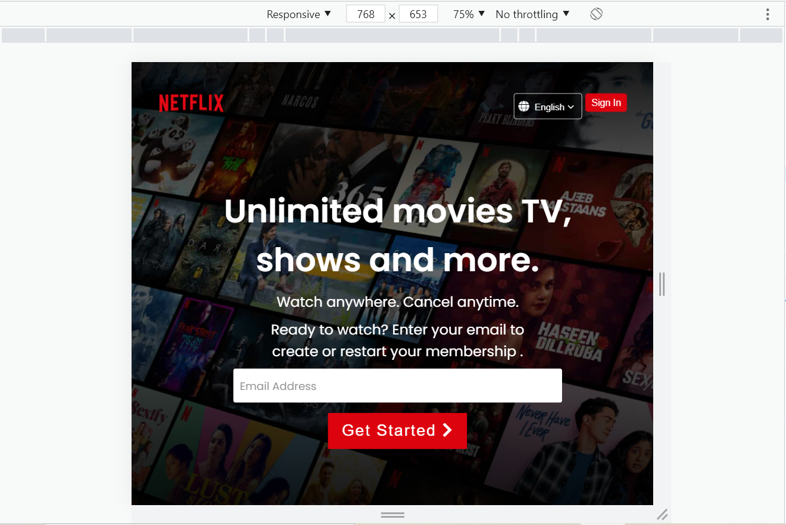
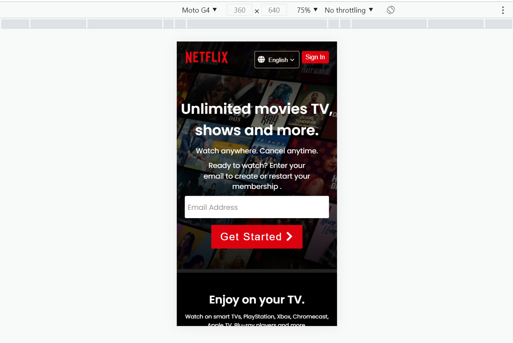

# Netflix UI Clone

## Overview of the Application

This a simple project where I created a clone of Netflix and it is completely responsive.

## Tech Stack

## ScreenShots

A. In Laptop Screen, UI looks like: 

B. In Medium Devices, UI looks like: 

C. In Mobile Devices, UI looks like: 

## Live Demo

