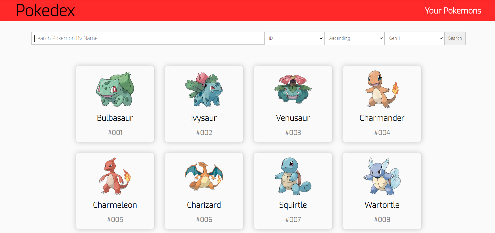
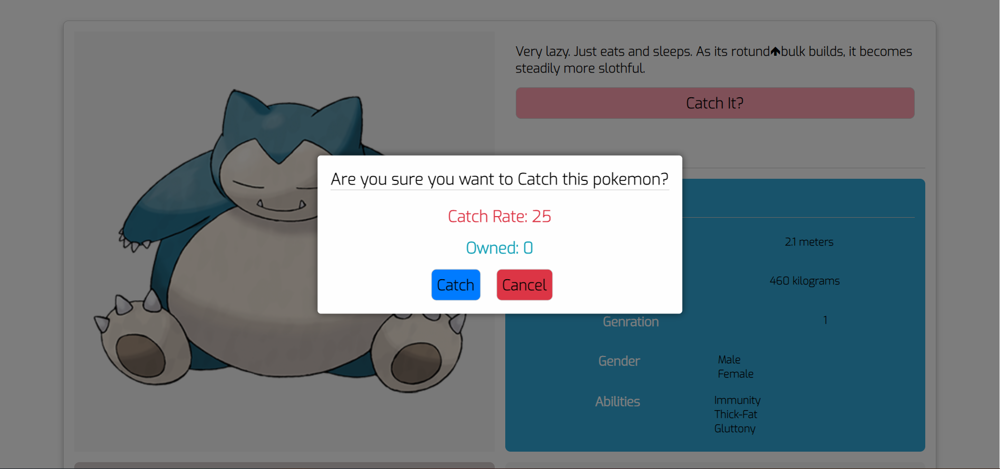
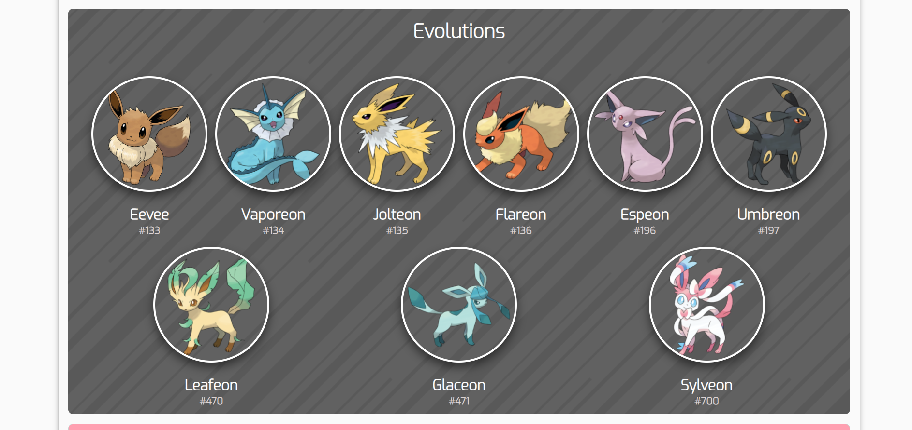

# Pokedex App Made With React and Redux

## Description

---

This is a pokedex app made with react and redux it allows you to search through the pokemon database and view their stats,abilities, moves, types and so on. It also allows you to catch pokemons and them to your team. It also features cool filters to search pokemons like by generation, height, weight, and of course name etc.

## Running the app

---

Clone this repository or download the zip file. Go to the root of the project and run the following commands:

```
$ npm install
```

```
$ npm start
```

And then go to the [localhost:3000](localhost:3000) to see the app in action.

# Screenshots


<br>
<br>

<br>
<br>


# Thanks For Visiting! :)
