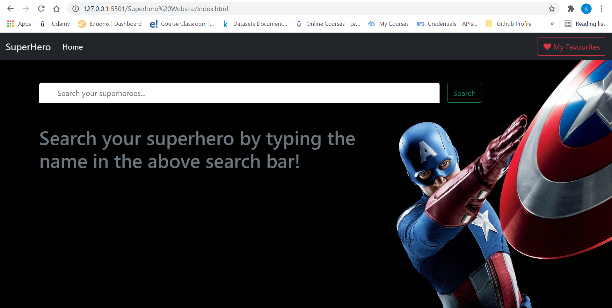
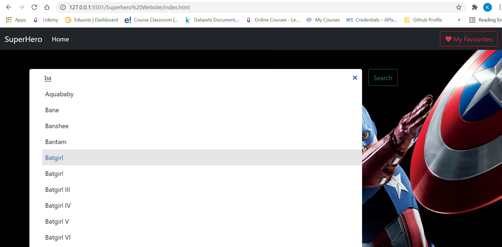
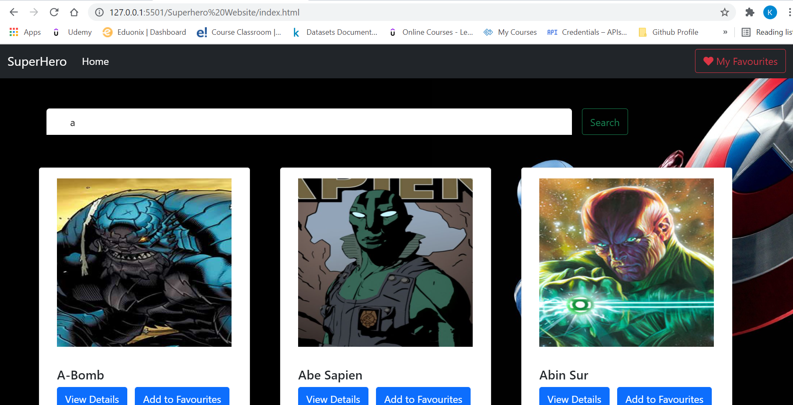
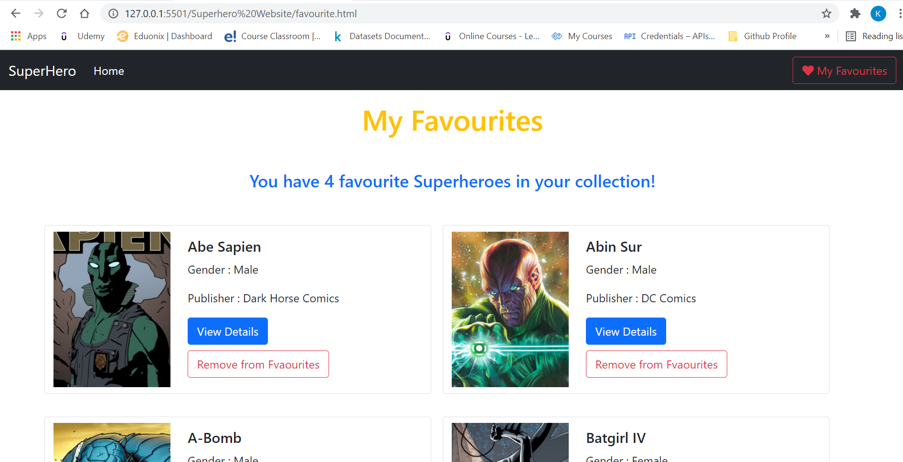

# SuperHero Website

## Overview of the Application

This a simple project where I created a superhero website. It is responsive as well.

## Features 

1. Home page -> a search bar : User can search superhero from here, and result will be in the form of card

2. A single card should have superhero name basic details and poster and a view and addTofavourite button

3. When user click on view details, a superhero details page will open

4. addToFavorite button -> on click of it add super hero in favourite list

5. favourite page -> show list of favourite super hero here ( with the help of local storage)

6. Remove favourite button and remove superhero from page on click .

## Tech Stack

## ScreenShots

A. Initially UI looks like: 

B. Searching a superhero: 

C. Getting superheros in the form of cards: 

D. View Page (Detail Page)

E. Favourite Page

